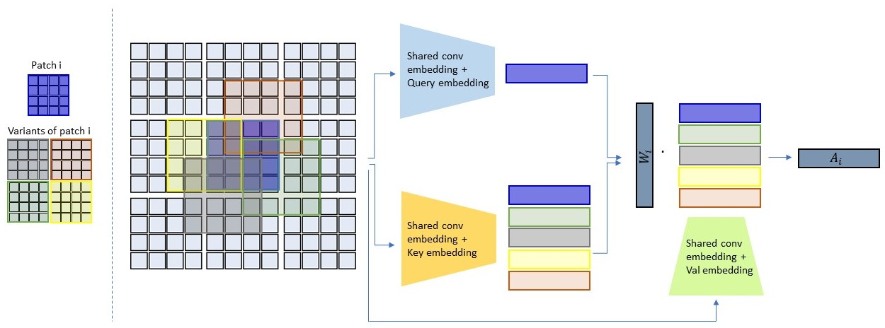

# Locally-Shifted-Attention-With-Early-Global-Integration

## Pretrained models
You can download all the models from [here](https://drive.google.com/drive/folders/19NyfUxEebz_QanA99m_KIgIbPR5QY0OL?usp=sharing).

## Training
### Imagenet
* python -m torch.distributed.launch --nproc_per_node=8  --use_env main_tiny_imagenet.py --data-set IMNET --model tiny_patch0 --data-path PATH_TO_IMAGENET --batch-size 92 --output_dir output

* python -m torch.distributed.launch --nproc_per_node=8  --use_env main_small_imagenet.py --data-set IMNET --model tiny_patch0 --data-path PATH_TO_IMAGENET --batch-size 64 --output_dir output

### CIFAR
* python -m torch.distributed.launch --nproc_per_node=8  --use_env main_tiny_cifar.py --data-set cifar10 --model tiny_patch0 --data-path PATH_TO_CIFAR --batch-size 92 --output_dir output

* python -m torch.distributed.launch --nproc_per_node=8  --use_env main_small_cifar.py --data-set cifar10 --model tiny_patch0 --data-path PATH_TO_CIFAR --batch-size 40 --output_dir output

* python -m torch.distributed.launch --nproc_per_node=8  --use_env main_base_cifar.py --data-set cifar10 --model tiny_patch0 --data-path PATH_TO_CIFAR --batch-size 20 --output_dir output
